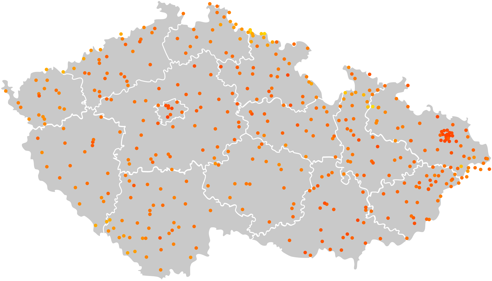
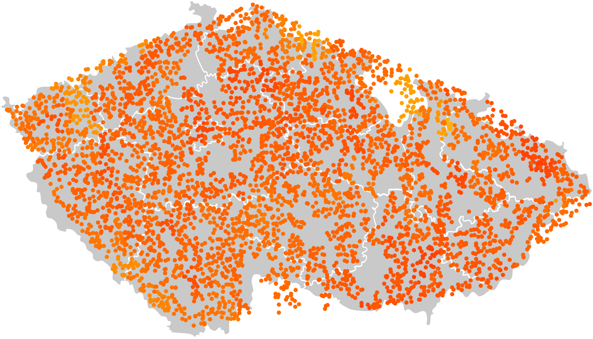
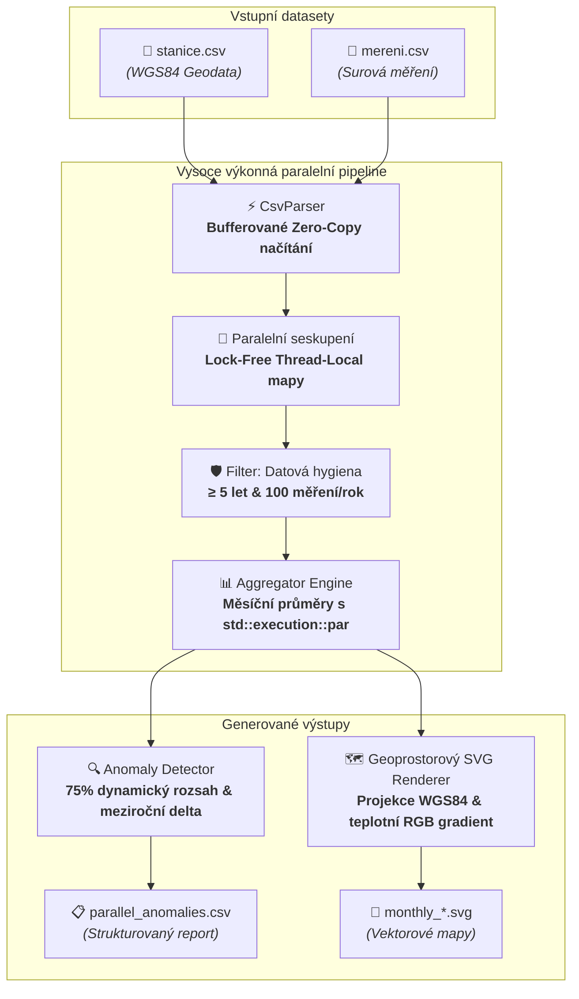

<div align="center">

# 🌦️ MeteoScope Engine

**Vysoce výkonný detektor meteorologických časových anomálií a vizualizační vektorová pipeline v C++20**

[](https://en.cppreference.com/w/cpp/20)
[](https://cmake.org/)
[](LICENSE)
[](CMakeLists.txt)
[](#-v%C3%BDkonnostn%C3%AD-benchmarky)

[](https://github.com/TheRealMiroslav/meteoscope-engine/actions/workflows/ci.yml)

<p align="center">
  <a href="README.md"><b>English</b></a> •
  <a href="README.cs.md"><b>Čeština</b></a>
</p>

</div>

---

## 📑 Obsah

- [Cíl projektu a motivace](#-cíl-projektu-a-motivace)
- [Klíčové vlastnosti](#-klíčové-vlastnosti)
- [Vizuální ukázky výstupů](#-vizuální-ukázky-výstupů)
- [Architektura systému](#-architektura-systému)
- [Výkonnostní benchmarky](#-výkonnostní-benchmarky)
- [Technologický stack](#-technologický-stack)
- [Začínáme](#-začínáme)
    - [Požadavky](#požadavky)
    - [Instrukce k sestavení](#instrukce-k-sestavení)
    - [Použití v příkazové řádce](#použití-v-příkazové-řádce)
- [Datové formáty](#-datové-formáty)
- [Konfigurace](#-konfigurace)
- [Komunita a správa repozitáře](#-komunita-a-správa-repozitáře)
- [Licence](#-licence)

---

## 🎯 Cíl projektu a motivace

**MeteoScope Engine** vznikl jako intenzivní technická případová studie systémového programování a optimalizace výkonu.
Hlavním cílem nebylo vytvoření komerční spotřebitelské aplikace, ale hloubkové prozkoumání a praktické zvládnutí
**moderního C++20, souběžného programování bez zamykání (lock-free concurrency) a efektivního I/O s minimální režií**.

Projekt slouží jako technická demonstrace odpovídající na otázku:  
*Jak rychle dokážeme načíst, profiltrovat, zprůměrovat a zanalyzovat desítky milionů časových záznamů bez použití
těžkopádných externích frameworků či databází?*

Využitím nízkoúrovňového paměťového bufferování, vlastního dělení řádků pomocí `<charconv>`, lock-free thread-local
Map-Reduce agregace a vícevláknového generování SVG vektorové grafiky zpracuje tento engine **více než 61 milionů měření
za necelých 3.9 sekundy** na běžném vícejádrovém procesoru.

---

## ✨ Klíčové vlastnosti

- **⚡ Lock-Free paralelní pipeline:** Vícevláknová architektura využívající `std::thread`, `std::execution::par` a
  thread-local akumulátory, které zcela eliminují zamykání (mutex contention) během seskupování masivních objemů dat.
- **🚀 Vysoce propustný CSV parser:** Vlastní zero-allocation parser s jednorázovým načtením do paměťového bufferu,
  zarovnáním na konce řádků a bleskovým čtením čísel přes `std::from_chars`.
- **🔍 Dynamická detekce anomálií:** Výpočet plovoucího prahu pro každý měsíc na základě historického rozpětí
  ($Threshold_m = 0.75 \times (Max_m - Min_m)$) s okamžitým záchytem skokových meziročních změn.
- **🗺️ Geoprostorový vektorový engine:** Ohraničená lineární projekce převádějící GPS souřadnice na pixely SVG plátna s
  plynulým vícebodovým RGB gradientem teplot.
- **🛡️ Robustní datová hygiena:** Automatický filtr vyřazující neucelená data na základě minimální délky měření ($\ge 5$
  po sobě jdoucích let) a hustoty záznamů ($\ge 100$ měření za rok).
- **⏱️ Mikrosekundová telemetrie:** Integrované stopky `std::chrono::high_resolution_clock` pro přesné profilování
  jednotlivých fází (I/O, filtrace, agregace, vizualizace).

---

## 🖼️ Vizuální ukázky výstupů

Engine promítá agregované průměrné teploty jednotlivých stanic přímo do vektorových SVG map.

> **Poznámka k datům:** Vzhledem k velikosti (stovky megabajtů až gigabajty) nejsou surové CSV datasety ani podkladová
> SVG mapa součástí repozitáře. Níže uvádíme ukázky výstupů vygenerovaných na testovacích sadách:

### 1. Kalibrovaná síť stanic (Malý dataset)

Načtení očištěných stanic přesně kalibrovaných v rámci geografických hranic České republiky pro měsíc červen:

<div align="center">
  
  <p><i>Obrázek 1: Vygenerovaná SVG mapa pro červen (Malý dataset, cca 500 stanic). Barevná škála přechází od chladnějších (modrá/zelená) po teplejší (oranžová/červená).</i></p>
</div>

### 2. Zátěžový test s vysokou hustotou (Velký dataset)

Zpracování rozsáhlé surové dávky (5 500+ stanic, 61M+ měření). Demonstrace vysoké propustnosti a chování projekce na
datech, kde část souřadnic mírně přesahuje kalibrované území:

<div align="center">
  
  <p><i>Obrázek 2: Zátěžový výstup pro červen s 5 500+ stanicemi. Surová data s vysokou hustotou bodů sahající i k okrajům bounding boxu.</i></p>
</div>

---

## 🏗️ Architektura systému



---

## 📊 Výkonnostní benchmarky

Měřeno na sadách testovacích dat s aktivní kompletní telemetrií (Hardware: vícejádrový x86_64, Release sestavení):

| Velikost datasetu    | Počet stanic | Počet záznamů | Sériový běh | Paralelní běh | Zrychlení (Speedup) |
|:---------------------|:------------:|:-------------:|:-----------:|:-------------:|:-------------------:|
| **Malý (Small)**     |     512      |   4 701 195   |   0.909 s   |  **0.291 s**  |      **3.12x**      |
| **Střední (Medium)** |    2 012     |  21 078 707   |   4.034 s   |  **1.257 s**  |      **3.21x**      |
| **Velký (Large)**    |    5 512     |  61 623 333   |  12.005 s   |  **3.850 s**  |      **3.12x**      |

> V paralelním režimu je **více než 61 milionů záznamů** načteno, zfiltrováno, zprůměrováno a zkontrolováno na anomálie
> za pouhých **3.85 sekundy** (2.57 s načtení z disku + 1.28 s vícevláknové výpočty).

Detailní rozpis jednotlivých fází naleznete v souboru [src/utils/SpeedBook.txt](src/utils/SpeedBook.txt).

---

## 🛠️ Technologický stack

| Komponenta            | Technologie                          | Odůvodnění volby                                                                             |
|:----------------------|:-------------------------------------|:---------------------------------------------------------------------------------------------|
| **Jazyk aplikace**    | C++20                                | Moderní ranges (`std::views`), `<charconv>`, strukturované vazby a nulový paměťový overhead. |
| **Souběžnost**        | `std::thread`, `std::execution::par` | Hardwarově škálovaný thread pool, efektivní Map-Reduce vzor bez externích knihoven.          |
| **Build systém**      | CMake 3.15+                          | Standardní konfigurace pro MSVC, GCC i Clang.                                                |
| **Vektorová grafika** | Scalable Vector Graphics (SVG)       | Škálovatelný XML formát nezávislý na rozlišení s podporou inline CSS barev.                  |
| **Profilování**       | `std::chrono::high_resolution_clock` | Monotonické stopky s mikrosekundovým rozlišením.                                             |

---

## 🚀 Začínáme

### Požadavky

- **C++ Kompilátor:** Plná podpora standardu C++20
    - GCC 10.0+ / Clang 11.0+ (Linux/macOS)
    - MSVC 19.29+ (Visual Studio 2019/2022 pro Windows)
- **Build systém:** CMake $\ge 3.15$
- **Git**

### Instrukce k sestavení

```bash
# 1. Klonování repozitáře
git clone https://github.com/TheRealMiroslav/meteoscope-engine.git
cd meteoscope-engine

# 2. Konfigurace projektu
cmake -B build -DCMAKE_BUILD_TYPE=Release

# 3. Kompilace spustitelného souboru
cmake --build build --config Release -j
```

Zkompilovaná binárka `meteoscope` (případně `meteoscope.exe` na Windows) bude uložena ve složce `build/` (nebo
`build/Release/`).

### Použití v příkazové řádce

Spustitelný soubor vyžaduje přesně 3 parametry:

```bash
./meteoscope <cesta_ke_stanicim.csv> <cesta_k_merenim.csv> <--serial|--parallel>
```

#### Paralelní režim (Doporučeno pro produkční objemy dat)

```bash
./meteoscope data/stanice.csv data/mereni.csv --parallel
```

#### Sériový režim (Vhodné pro debugging a porovnání)

```bash
./meteoscope data/stanice.csv data/mereni.csv --serial
```

#### Výstup v konzoli

```text
================================================
       METEOROLOGICAL ANALYSIS COMPLETE         
================================================
 Mode:              PARALLEL
 Station Count:     5512
 Measurement Count: 61623333
------------------------------------------------
 Load Time:         2.574 s
 Processing Time:   1.276 s
------------------------------------------------
 TOTAL TIME:        3.850 s
================================================
```

---

## 📂 Datové formáty

### 1. CSV stanic (`stanice.csv`)

Záznamy oddělené středníkem definující zeměpisné souřadnice:

```csv
id;latitude;longitude
1;50.0875;14.4211
2;49.1951;16.6068
```

### 2. CSV měření (`mereni.csv`)

Záznamy oddělené středníkem obsahující surová měření teplot:

```csv
id;ordinal;year;month;value
1;1;2020;1;-2.4
1;2;2020;1;-1.8
```

### 3. Výstupní CSV report anomálií (`maps/parallel_anomalies.csv`)

Záznamy oddělené středníkem seřazené chronologicky:

```csv
station_id;month;year;diff
1;7;2022;5.820000
```

---

## ⚙️ Konfigurace

Aplikační konstanty a geografické ohraničení mapy lze upravit v souboru [src/utils/Config.h](src/utils/Config.h):

```cpp
namespace Config {
    // Geografické hranice projekce (výchozí pro Českou republiku)
    constexpr double LAT_MAX = 51.03806105663445;
    constexpr double LAT_MIN = 48.521003814763994;
    constexpr double LON_MIN = 12.102209054269062;
    constexpr double LON_MAX = 18.866923511078615;

    // Rozměry plátna a kalibrace
    constexpr int SVG_WIDTH = 1412;
    constexpr int SVG_HEIGHT = 809;
    constexpr int STATION_RADIUS = 5;

    // Cesty k šablonám a výstupům
    constexpr const char *MAP_SVG_PATH = "czmap.svg";
    constexpr const char *OUTPUT_DIR_BASE = "maps/";
}
```

---

## 🤝 Komunita a správa repozitáře

- [Příručka přispěvatele (CONTRIBUTING.md)](CONTRIBUTING.md) — Workflow vývoje, konvence Conventional Commits a kódové
  standardy.
- [Pravidla chování (CODE_OF_CONDUCT.md)](CODE_OF_CONDUCT.md) — Contributor Covenant v3.0.
- [Zabezpečení (SECURITY.md)](SECURITY.md) — Proces hlášení bezpečnostních zranitelností a podpora verzí.

---

## 📄 Licence

Tento projekt je licencován pod **MIT licencí**. Podrobnosti naleznete v souboru [LICENSE](LICENSE).

<div align="center">
  <sub>Vyvinuto s precizností · 2026 miroslav.v</sub>
</div>
