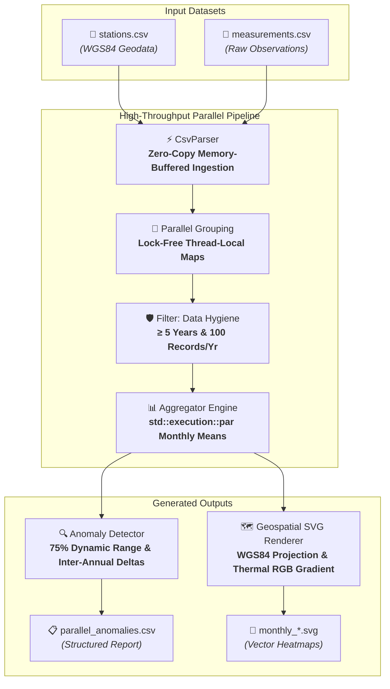

<div align="center">

# 🌦️ MeteoScope Engine

**High-Performance Geospatial Meteorological Time-Series Anomaly Detector & Vector Visualization Pipeline in C++20**

[](https://en.cppreference.com/w/cpp/20)
[](https://cmake.org/)
[](LICENSE)
[](CMakeLists.txt)
[]()
[](#-performance-benchmarks)

<p align="center">
  <a href="README.md"><b>English</b></a> •
  <a href="README.cs.md"><b>Čeština</b></a>
</p>

</div>

---

## 📑 Table of Contents

- [Project Purpose & Motivation](#-project-purpose--motivation)
- [Key Features](#-key-features)
- [Visual Output & Samples](#-visual-output--samples)
- [System Architecture](#-system-architecture)
- [Performance Benchmarks](#-performance-benchmarks)
- [Tech Stack](#-tech-stack)
- [Getting Started](#-getting-started)
    - [Prerequisites](#prerequisites)
    - [Build Instructions](#build-instructions)
    - [CLI Usage](#cli-usage)
- [Data Formats](#-data-formats)
- [Configuration](#-configuration)
- [Community & Governance](#-community--governance)
- [License](#-license)

---

## 🎯 Project Purpose & Motivation

**MeteoScope Engine** was developed as an exploratory systems programming and performance engineering study. The primary
objective was not to build a generic commercial product, but to deeply understand and master **modern C++20 concurrency,
zero-copy memory I/O, and hardware-bounded parallel scaling**.

The project serves as a concrete technical showcase answering the question:  
*How fast can we ingest, filter, aggregate, and detect anomalies across tens of millions of time-series records without
relying on heavyweight external frameworks or databases?*

By utilizing low-level memory buffering, custom line chunking with `<charconv>`, lock-free thread-local Map-Reduce
aggregation, and multi-threaded SVG vector generation, the engine processes **over 61 million records in under 3.9
seconds** on standard consumer hardware.

---

## ✨ Key Features

- **⚡ Lock-Free Parallel Pipeline:** Multi-core architecture using `std::thread`, `std::execution::par`, and
  thread-local accumulators, completely eliminating mutex contention during large-scale data grouping.
- **🚀 Zero-Allocation CSV Ingestion:** Custom parser using single-syscall memory buffering, newline boundary discovery,
  and fast `std::from_chars` numeric conversion.
- **🔍 Dynamic Anomaly Detection:** Calculates dynamic deviation thresholds per calendar month based on historical range
  ($Threshold_m = 0.75 \times (Max_m - Min_m)$) to detect acute inter-annual temperature swings.
- **🗺️ Vector Cartography Engine:** Bounded geospatial linear projection converting WGS84 coordinates into 2D SVG canvas
  points with continuous multi-stop RGB thermal gradient interpolation.
- **🛡️ Quality Assurance Filter:** Data hygiene filter requiring minimum temporal continuity ($\ge 5$ consecutive years)
  and observation density ($\ge 100$ records/year) to eliminate uncalibrated or sparse stations.
- **⏱️ Microsecond Telemetry:** Integrated monotonic clock instrumentation measuring discrete loading, grouping,
  filtering, aggregation, and visualization phases.

---

## 🖼️ Visual Output & Samples

The engine projects aggregated monthly station temperatures onto vector maps.

> **Note on Data:** Raw multi-gigabyte CSV datasets and the base SVG template map are omitted from this repository due
> to file size constraints. Sample generated SVGs demonstrating the pipeline output are provided below:

### 1. Calibrated Station Network (Small Dataset)

Ingestion of curated meteorological stations strictly calibrated within the geographic boundary of the Czech Republic
for the month of June:

<div align="center">
  
  <p><i>Figure 1: Generated SVG map for June (Small Dataset, ~500 stations). Thermal scale transitions from cool (blue/green) to warm (orange/red).</i></p>
</div>

### 2. High-Density Stress Test (Large Dataset)

Processing massive uncurated batches (5,500+ stations, 61M+ measurements). Demonstrates high-throughput projection
density and illustrates how the projection handles raw data where outlier station coordinates extend beyond calibrated
borders:

<div align="center">
  
  <p><i>Figure 2: Stress-test output for June with 5,500+ stations. Raw data points distributed across and slightly beyond regional boundaries.</i></p>
</div>

---

## 🏗️ System Architecture



---

## 📊 Performance Benchmarks

Measured on high-throughput test runs with full phase profiling enabled (Hardware: multi-core x86_64, Release build):

| Dataset Tier | Stations | Records Count | Serial Execution | Parallel Execution |  Speedup  |
|:-------------|:--------:|:-------------:|:----------------:|:------------------:|:---------:|
| **Small**    |   512    |   4,701,195   |     0.909 s      |    **0.291 s**     | **3.12x** |
| **Medium**   |  2,012   |  21,078,707   |     4.034 s      |    **1.257 s**     | **3.21x** |
| **Large**    |  5,512   |  61,623,333   |     12.005 s     |    **3.850 s**     | **3.12x** |

> In parallel mode, **over 61 million records** are ingested, grouped, filtered, aggregated, and checked for anomalies
> in **3.85 seconds** (2.57s I/O ingestion + 1.28s parallel analytics).

Detailed per-phase breakdown is documented in [src/utils/SpeedBook.txt](src/utils/SpeedBook.txt).

---

## 🛠️ Tech Stack

| Component           | Technology                           | Rationale                                                                                        |
|:--------------------|:-------------------------------------|:-------------------------------------------------------------------------------------------------|
| **Core Language**   | C++20                                | Modern ranges (`std::views`), `<charconv>`, structured bindings, and zero-overhead abstractions. |
| **Concurrency**     | `std::thread`, `std::execution::par` | Hardware-concurrency thread pooling, lock-free Map-Reduce without external dependencies.         |
| **Build System**    | CMake 3.15+                          | Standard cross-platform configuration across MSVC, GCC, and Clang.                               |
| **Vector Graphics** | Scalable Vector Graphics (SVG)       | Resolution-independent vector maps with embedded RGB styling.                                    |
| **Profiling**       | `std::chrono::high_resolution_clock` | Monotonic microsecond phase telemetry.                                                           |

---

## 🚀 Getting Started

### Prerequisites

- **C++ Compiler:** Full C++20 support
    - GCC 10.0+ / Clang 11.0+ (Linux/macOS)
    - MSVC 19.29+ (Visual Studio 2019/2022 on Windows)
- **Build System:** CMake $\ge 3.15$
- **Git**

### Build Instructions

```bash
# 1. Clone repository
git clone https://github.com/TheRealMiroslav/meteoscope-engine.git
cd meteoscope-engine

# 2. Configure build directory
cmake -B build -DCMAKE_BUILD_TYPE=Release

# 3. Build executable
cmake --build build --config Release -j
```

The compiled binary `meteoscope` (or `meteoscope.exe` on Windows) will be placed in `build/` (or `build/Release/`).

### CLI Usage

The executable takes exactly three arguments:

```bash
./meteoscope <stations.csv> <measurements.csv> <--serial|--parallel>
```

#### Parallel Execution (Recommended)

```bash
./meteoscope data/stations.csv data/measurements.csv --parallel
```

#### Serial Execution (Single-threaded baseline)

```bash
./meteoscope data/stations.csv data/measurements.csv --serial
```

#### Console Telemetry Output

```text
================================================
       METEOROLOGICAL ANALYSIS COMPLETE         
================================================
 Mode:              PARALLEL
 Station Count:     5512
 Measurement Count: 61623333
------------------------------------------------
 Load Time:         2.574 s
 Processing Time:   1.276 s
------------------------------------------------
 TOTAL TIME:        3.850 s
================================================
```

---

## 📂 Data Formats

### 1. Stations CSV (`stations.csv`)

Semicolon-delimited records defining station coordinates:

```csv
id;latitude;longitude
1;50.0875;14.4211
2;49.1951;16.6068
```

### 2. Measurements CSV (`measurements.csv`)

Semicolon-delimited raw temperature observations:

```csv
id;ordinal;year;month;value
1;1;2020;1;-2.4
1;2;2020;1;-1.8
```

### 3. Anomaly Output Report (`maps/parallel_anomalies.csv`)

Semicolon-delimited records sorted chronologically:

```csv
station_id;month;year;diff
1;7;2022;5.820000
```

---

## ⚙️ Configuration

Application parameters and geospatial bounds can be modified in [src/utils/Config.h](src/utils/Config.h):

```cpp
namespace Config {
    // Geographic Projection Bounds (Czech Republic coordinate bounding box)
    constexpr double LAT_MAX = 51.03806105663445;
    constexpr double LAT_MIN = 48.521003814763994;
    constexpr double LON_MIN = 12.102209054269062;
    constexpr double LON_MAX = 18.866923511078615;

    // Canvas Calibration Configuration
    constexpr int SVG_WIDTH = 1412;
    constexpr int SVG_HEIGHT = 809;
    constexpr int STATION_RADIUS = 5;

    // Asset & Output Paths
    constexpr const char *MAP_SVG_PATH = "czmap.svg";
    constexpr const char *OUTPUT_DIR_BASE = "maps/";
}
```

---

## 🤝 Community & Governance

- [Contributing Guide](CONTRIBUTING.md) — Workflow guidelines, Conventional Commits, code standards.
- [Code of Conduct](CODE_OF_CONDUCT.md) — Contributor Covenant v3.0.
- [Security Policy](SECURITY.md) — Vulnerability reporting and disclosure.

---

## 📄 License

Distributed under the **MIT License**. See [LICENSE](LICENSE) for details.

<div align="center">
  <sub>Engineered with precision · 2026 miroslav.v</sub>
</div>
